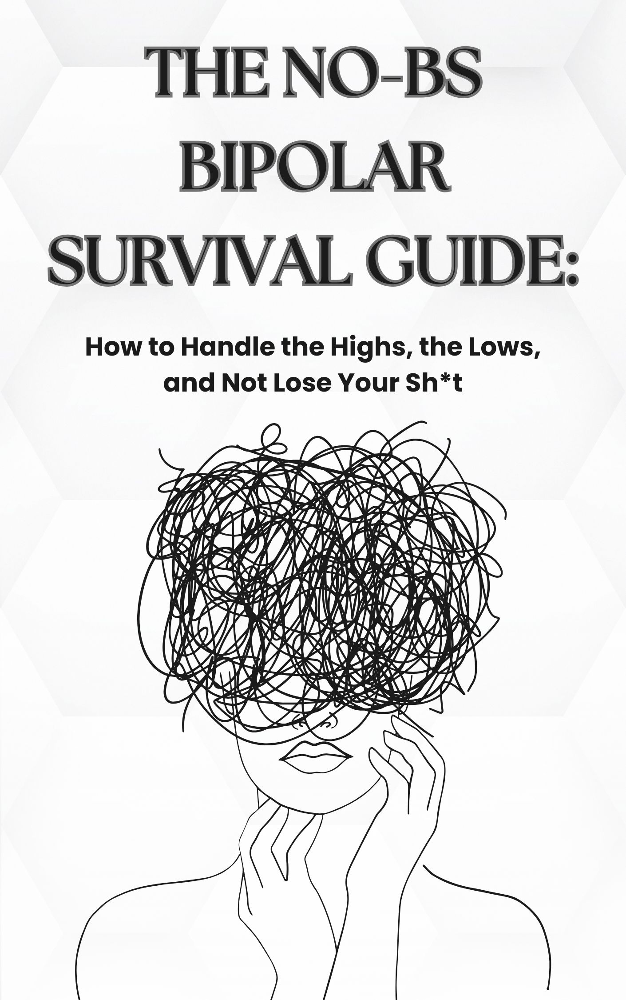

# The No-BS Bipolar Survival Guide - Book Promotional Website

## Overview
Official website for "**The No-BS Bipolar Survival Guide: How to Handle the Highs, the Lows, and Not Lose Your Sh*t**" by Nichole Higgins. This responsive website promotes the book and provides resources for partners, families, and loved ones dealing with bipolar disorder.

[➡️ Visit Live Site](https://yourgithubusername.github.io/repositoryname/)  
[📚 View on Amazon](https://www.amazon.com/No-BS-Bipolar-Survival-Guide-Handle-ebook/dp/B0FLWMLH95)

## Book Description
A raw, real-world manual for the exhausted, the confused, and the terrified dealing with bipolar disorder. This guide provides concrete advice on:

- Spotting warning signs before crises escalate
- Navigating manic, depressive, and mixed episodes
- Setting boundaries to protect yourself
- Managing financial chaos and verbal abuse
- Confronting hypersexuality and intimacy breakdowns
- Making decisions that are right for YOU

> "This isn't a story about love conquering all. It's about surviving a love that can feel like a battlefield."

## Website Features
- **Responsive Design**: Works on all devices (desktop, tablet, mobile)
- **Modern UI/UX**: Clean professional layout with intuitive navigation
- **Interactive Elements**: Smooth scrolling, hover effects, and animations
- **Performance Optimized**: Fast loading with optimized assets
- **SEO-Friendly**: Proper meta tags and schema markup for search engines

## Technologies Used
- **Frontend**: HTML5, CSS3, JavaScript
- **Styling**: Custom CSS with modern design principles
- **Interactivity**: Vanilla JavaScript animations
- **Compatibility**: Works on all modern browsers

## Website Sections
1. **Hero Section** - Eye-catching introduction with call-to-action
2. **Book Details** - Comprehensive information about the book's content
3. **Key Points** - Five crucial takeaways from the guide
4. **Author Bio** - Information about Nichole Higgins
5. **Purchase Options** - Links to buy ebook and paperback versions
6. **Footer** - Copyright and social media links

## Purchase Options
The book is available in two formats:

| Format | Link |
|--------|------|
| 📱 E-Book | [Amazon Kindle Edition](https://a.co/d/5BPNBb1) |
| 📖 Paperback | [Amazon Paperback Edition](https://a.co/d/96XUMMG) |

## Copyright & License
© 2025 Nichole Higgins | The Phantom Ink Creative. All rights reserved.

**Protected Content**: This website and its contents are protected by copyright law. No part of this project may be reproduced, distributed, or transmitted in any form without prior written permission from the copyright holder.

## Contact Author
For inquiries and media requests:
- [💼 LinkedIn](https://www.linkedin.com/in/nichole-higgins423/)
- [✍️ Medium](https://medium.com/@nhiggins11688)
- [👍 Facebook](https://www.facebook.com/profile.php?id=61577108068829)

---

**Note**: This repository contains the complete source code for the promotional website. The live version is hosted on GitHub Pages.
